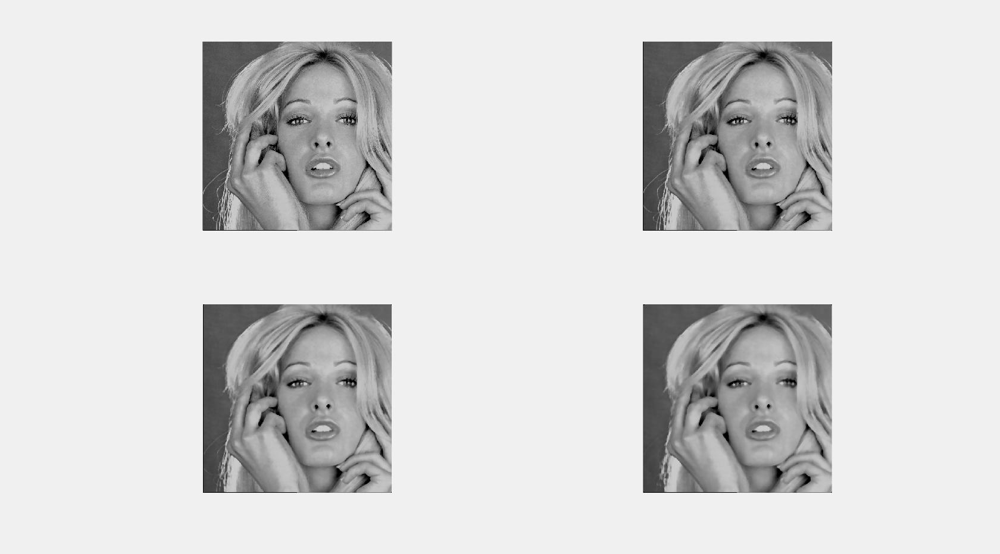
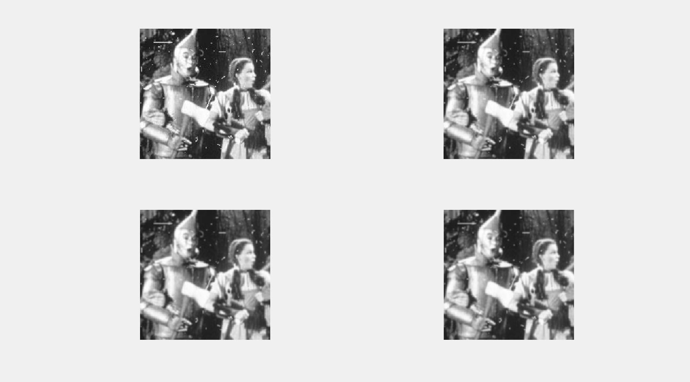
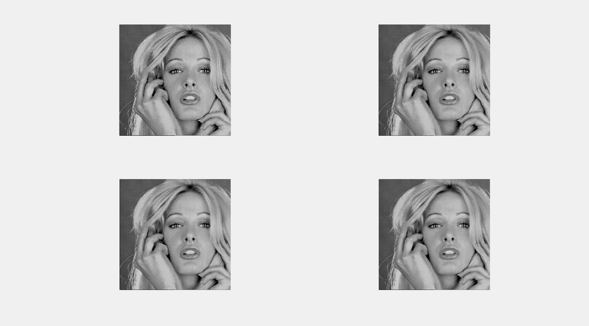
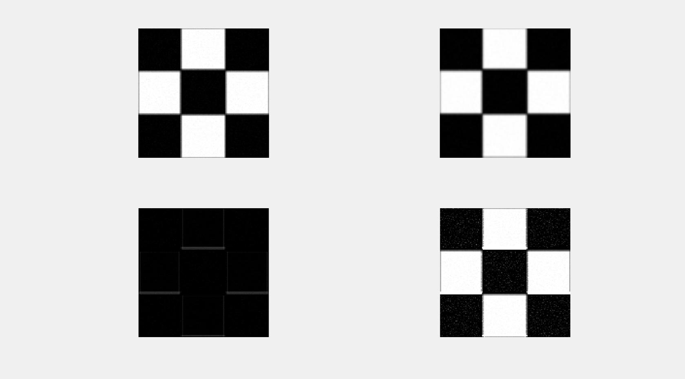
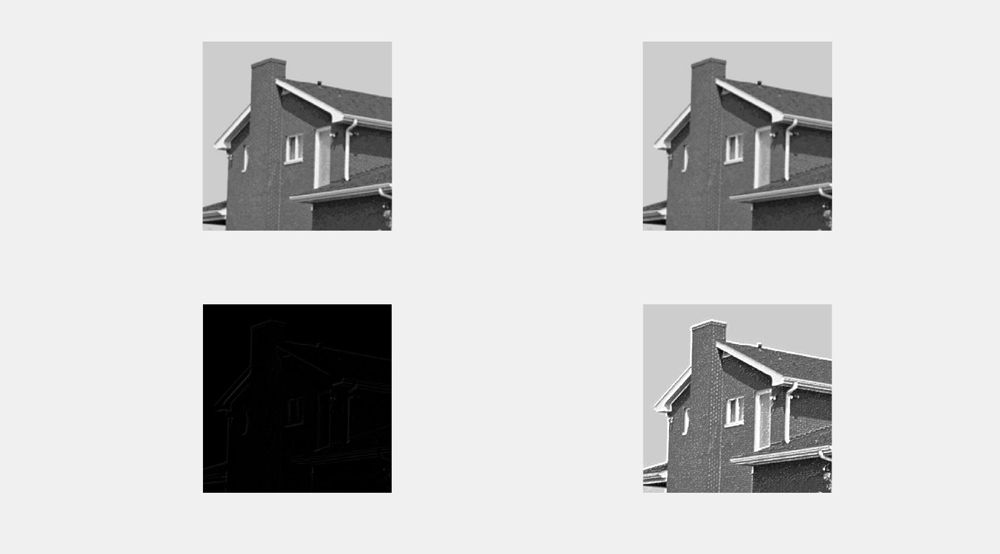
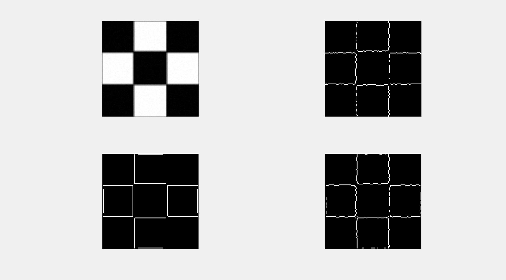
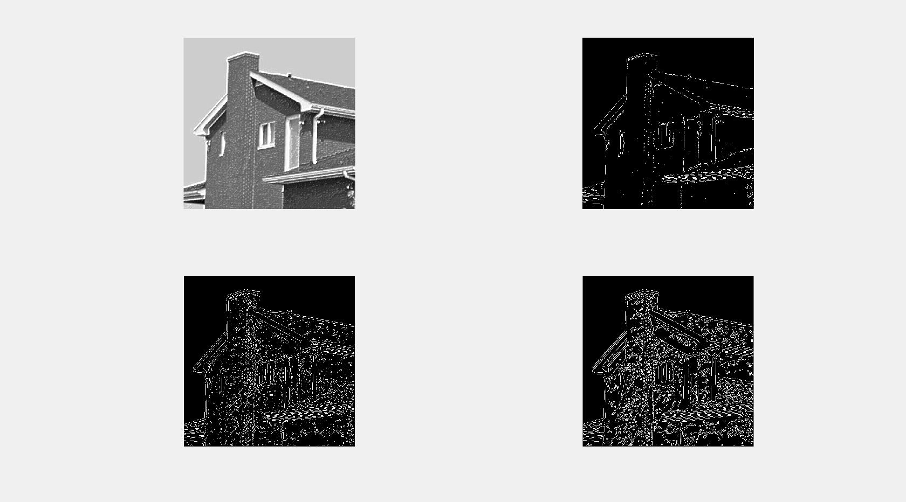

# 第四次作业

姓名：张晟

班级：自动化64

学号：2160504107

日期：2019/3/19

## 摘要

本题主要考察空域滤波器，主要使用了中值滤波和高斯滤波两种方式，并对结果进行对比。还探究了反锐化掩模，Sobel，Laplace，Canny等算法。

### 第一题

#### 题目描述

空域低通滤波器：分别用高斯滤波器和中值滤波器去平滑测试图像test1和2，模板大小分别是3x3 ， 5x5 ，7x7； 分析各自优缺点；

#### 分析

中值滤波法是一种非线性平滑技术，它将每一像素点的灰度值设置为该点某邻域窗口内的所有像素点灰度值的中值。中值滤波的基本原理是把数字图像或数字序列中一点的值用该点的一个邻域中各点值的中值代替，让周围的像素值接近的真实值，从而消除孤立的噪声点。方法是用某种结构的二维滑动模板，将板内像素按照像素值的大小进行排序，生成单调上升（或下降）的为二维数据序列。二维中值滤波输出为g（x,y）=med{f(x-k,y-l),(k,l∈W)} ，其中，f(x,y)，g(x,y)分别为原始图像和处理后图像。W为二维模板，通常为3*3，5*5区域。中值滤波可以使用medfilt2.

高斯滤波是一种线性平滑滤波，适用于消除高斯噪声，广泛应用于图像处理的减噪过程。通俗的讲，高斯滤波就是对整幅图像进行加权平均的过程，每一个像素点的值，都由其本身和邻域内的其他像素值经过加权平均后得到。高斯滤波的具体操作是：用一个模板（或称卷积、掩模）扫描图像中的每一个像素，用模板确定的邻域内像素的加权平均灰度值去替代模板中心像素点的值。

#### 结果

从左到右，从上到下，依次是原图像，3×3，5×5，7×7的中值滤波结果

从左到右，从上到下，依次是原图像，3×3，5×5，7×7的高斯滤波结果

#### 结果分析

共同之处在于滤波后噪点减少，图像整体感受更平滑，但是细节有一定程度的丢失。随着模板的增大，滤波的降噪能力增强，但是图像越来越模糊。在实际运用中要根据实际情况选择合适的滤波器。

|          | 优点                                                         | 缺点                 |
| -------- | ------------------------------------------------------------ | -------------------- |
| 中值滤波 | 中值滤波对脉冲噪声有良好的滤除作用，特别是在滤除噪声的同时，能够保护信号的边缘，使之不被模糊。这些优良特性是线性滤波方法所不具有的。 | 易造成图像的不连续性 |
| 高斯滤波 | 对于抑制服从正态分布的噪声非常有效。                         | 计算量大，耗时较长   |

### 第二题

#### 题目描述

利用固定方差 sigma=1.5产生高斯滤波器. 附件有产生高斯滤波器的方法； 分析各自优缺点

#### 分析

改变第一问中的sigma，重新进行高斯滤波即可

#### 结果

从左到右，从上到下，依次是原图像，3×3，5×5，7×7的高斯滤波结果

#### 结果分析

由于sigma变化幅度不大，所以基本上结果没有什么变化。

### 第三题

#### 题目描述

利用高通滤波器滤波测试图像test3,4：包括unsharp masking, Sobel edge detector, and Laplace edge detection；Canny algorithm.分析各自优缺点

#### 分析

反锐化掩模将原图像进行模糊预处理(相当于采用低通滤波)后与原图逐点做差值运算，然后乘上一个修正因子再与原图求和，以达到提高图像中高频成分、增强图像轮廓的目的. Sobel，Laplace，Canny分别是边缘提取的不同算子。

Sobel算子是像素图像边缘检测中最重要的算子之一，在机器学习、数字媒体、计算机视觉等信息科技领域起着举足轻重的作用。在技术上，它是一个离散的一阶差分算子，用来计算图像亮度函数的一阶梯度之近似值。在图像的任何一点使用此算子，将会产生该点对应的梯度矢量或是其法矢量。

该算子包含两组3x3的矩阵，分别为横向及纵向，将之与图像作平面卷积，即可分别得出横向及纵向的亮度差分近似值。如果以A代表原始图像，Gx及Gy分别代表经横向及纵向边缘检测的图像，其公式如下:

图像的每一个像素的横向及纵向梯度近似值可用以下的公式结合，来计算梯度的大小。

可用以下公式计算梯度方向。

Laplace算法公式：

再计算前要先进行高斯滤波以消除噪声

Canny算法时当前边缘检测的标准算法，其过程较为复杂，此处不做赘述，[Canny](https://baike.baidu.com/item/canny%E7%AE%97%E6%B3%95/8439208?fr=aladdin)

#### 结果

从左上到右下，依次是原图像，滤波图像，前二者之差，最终结果

从左上到右下，依次是原图像，Sobel，Laplace，Canny处理结果

#### 结果分析

在反锐化掩模过程中，最终结果与加权值相关，当高频分量权值较高时，高频噪声的作用体现出来，图像中出现许多噪点。在边缘提取过程中，sobel最简单，Laplace更适合处理较为简单的图像，Canny算子效果最好，能细致的反应出所有边缘细节。

|                 | 优点                                                   | 缺点                                     |
| --------------- | ------------------------------------------------------ | ---------------------------------------- |
| 反锐化掩模      | 增强了高频细节                                         | 受噪声影响大                             |
| Sobel边缘检测   | 对灰度渐变和噪声较多的图像处理效果较好                 | 对边缘定位不是很准确                     |
| Laplace边缘检测 | 各向同性的，能对任何走向的界线和线条进行锐化，无方向性 | 对噪声比较敏感，所以很少用该算子检测边缘 |
| Canny边缘检测   | 不容易受噪声干扰，能够检测到真正的弱边缘               | 处理简单图象时结果不尽如人意             |

